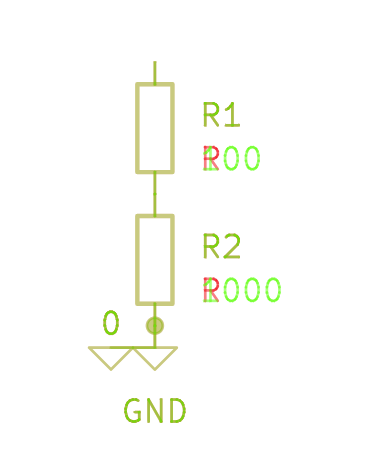

= Readme

Simple visual diff for kicad 7 or higher. one can easily extend
this tool to build a diff-er for anything that outputs svg.

This is not an official kicad tool or anything, just a friday night project.

My goal was just to get some `git` integration with the Kicad file formats.

When installed this tool should seamlessly integrate with git, assuming that `kicad-cli` is available on the path.

A goal for this tool is to have minimal dependencies, and be as transparently integrated into git as possible.

== Installation

.Requirements
* Git
* KiCad 7 or later (which comes with python 3+ and `pip`)

[source,shell]
----
# in kicad terminal
pip install kicad_gitdiff
----

== Usage

.Only once per repository
[source,shell]
----
kdiff_initialize
----
`kdiff_initialize` will modify the git configuration to call our custom tool when diff'ing `kicad_sch` files. Only needed to run once per repository.

It is possible to add these to your global configuration if you wish, just copy the generated file contents to your git global settings.

.Diff example
[source,shell]
----
# opens the web browser with a graphical diff
git diff HEAD~1 .\one_test.kicad_sch
----
This is typically how you would use git diff. There is no difference. This also means that a third party git browser could call the git commands as well.

.demo diff result

A bit painful on the eyes, but maybe useful 🐼

== Development

.Manually testing
[source,shell]
----
# from source folder, in kicad terminal
pip install -e .
----

Versioning uses link:https://github.com/ptaoussanis/encore/blob/master/BREAK-VERSIONING.md[BreakVer:]
[,]
----
<major>.<minor>.<non-breaking>[-<optional-qualifier>]:
------------------------------------------------------
<major>              - Major breaking changes [or discretionary "major non-breaking changes"]
<minor>              - Minor breaking changes [or discretionary "minor non-breaking changes"]
<non-breaking>       - **Strictly** (!!) NO breaking changes, ever
<optional-qualifier> - Tag-style qualifiers: -alpha1, -RC2, etc.
----

== Other diff tools

If you don't like this diff tool for any reason, here are some others:

* https://github.com/leoheck/kiri
* https://github.com/jnavila/plotkicadsch

== Other stuff

I'm currently dogfooding this tool, so it will hopefully prove useful.

.Other planned features
* pcb diff
* color-blind options? (red/green excludes a percentage of the population), general customization?

=== Internals

The magic that does this is the modification of
`.git\config` and `.gitattributes` which together tells git to launch
the `kicad_sch_diff` executable for diffing `.kicad_sch` files. This executable is provided in `setup.py` entry points, combined with `\\__init__.py` that imports and provides the scripts. In my own opinion it is still a bit ugly, but at least it only requires one config file (`setup.py`) together with `\\__init__.py` files which is required for discovery of the modules by setuptools.

.license
link:https://opensource.org/licenses/Apache-2.0[
image:https://img.shields.io/badge/License-Apache_2.0-blue.svg[]
]

.packaging
[source,shell]
----
# because I always forget
python setup.py sdist
python -m twine upload --repository testpypi dist/*
python -m twine upload dist/*
----